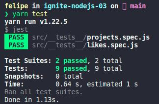

	

	<h1>Debugging wrong implementation and solving problems found</h1>

### Summary

- [About the challenge](#about-the-challenge)

- [Tests](#Tests)

### About the challenge

- In this challenge, I had to debug a broken application (CRUD of todos) to find the problems and solve them. [Click here](https://github.com/felipejsborges/ignite-nodejs-03/commit/d6d2adc63472df9c2082564480e1207c8ac9952b) to see the implementation.

### Tests

- **`Should be able to create a new repository`**

- **`Should be able to list the projects`**

- **`Should be able to update repository`**

- **`Should not be able to update a non existing repository`**

- **`Should not be able to update repository likes manually`**

- **`Should be able to delete the repository`**

- **`Should not be able to delete a non existing repository`**

- **`Should be able to give a like to the repository`**

- **`Should not be able to give a like to a non existing repository`**
 

	
	

by Felipe Borges 
[LinkedIn](https://www.linkedin.com/in/felipejsborges) | [GitHub](https://github.com/felipejsborges)
